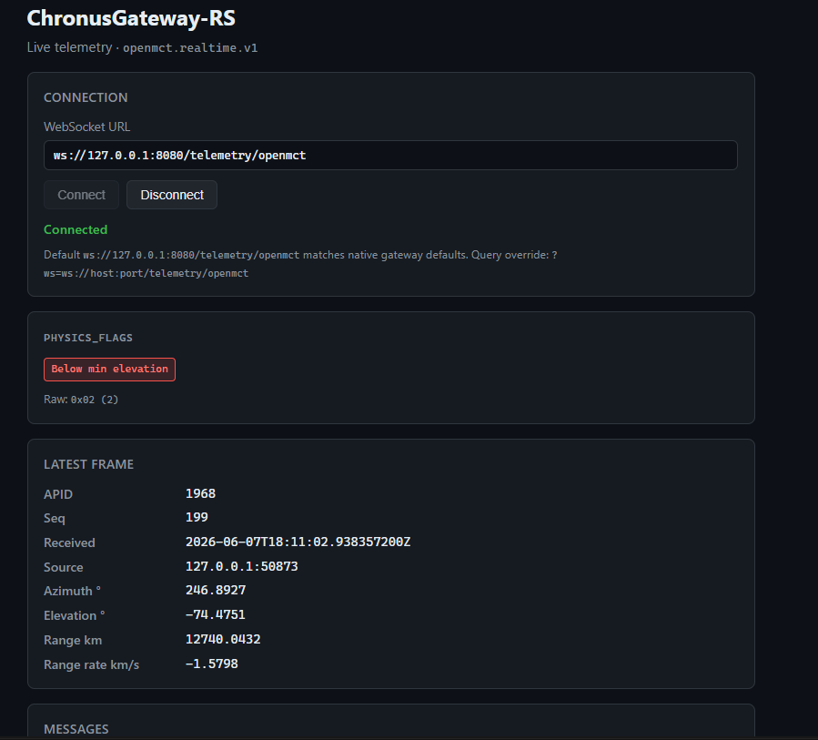

# ChronusGateway-RS

**A fast Rust gateway that turns satellite telemetry into trusted, web-ready data — and checks it against real orbital physics.**

Imagine a satellite circling Earth, constantly whispering raw binary back to a ground station: a long stream of ones and zeros. ChronusGateway-RS is a **translator and sanity-checker** for those whispers. It ingests CCSDS packets over UDP, validates them against physics computed in real time, and streams clean JSON to mission-control-style dashboards (including [NASA Open MCT](https://nasa.github.io/openmct/)–compatible clients).

**Live demo runbook:** [`docs/DEMO.md`](docs/DEMO.md).

## Trial run (Vitro)

Example of the gateway running end-to-end: UDP ingest → physics co-validation → WebSocket JSON consumed by the Showcase **S2** dashboard ([`demo/dashboard/`](demo/dashboard/)). In this capture, **`physics_flags`** reports **below minimum elevation** while azimuth, range, and range-rate update from the live propagator.



*Native trial run on loopback; synthetic/demo traffic only (`AGENTS.md`).*

---

## What it does (three steps)

### 1. The lightning-fast translator

Turning raw downlink bytes into something operators can read is usually heavy work. If the software falls behind, frames pile up and data is lost. ChronusGateway-RS uses an **async, non-blocking** network core (design patterns from the maintainer’s **Rusty_Server** project) so ingestion, parsing, and WebSocket fan-out keep pace: CCSDS frames become **`openmct.realtime.v1` JSON** and reach browsers with minimal buffering.

### 2. The built-in space map

While frames flow through the pipeline, a live **orbital math engine** ([**Ephemerust**](https://github.com/IsomorphicAlgo/Ephemerust)) tracks where the spacecraft is, how fast it is moving, and how it looks from your ground site — azimuth, elevation, range, and range-rate, updated on each frame (with sensible throttling).

### 3. Physics as a sanity check

Instead of trusting every field on the wire, the gateway runs **Physics–Telemetry Co-Validation**: measured RF and payload values are compared to what physics allows.

**The shadow check.** Example: a packet claims “full solar power” while the propagator says the spacecraft is in Earth’s shadow (or below your elevation mask). The gateway sets **`physics_flags`** on that frame so operators and automation see the mismatch — not a silent pass.

**The radio-wave squeeze (Doppler).** A fast-moving satellite shifts the carrier frequency you expect at the antenna. The gateway computes the non-relativistic Doppler shift from range-rate and your nominal carrier \(f_0\):

\[
\Delta f = - f_0 \left( \frac{\mathbf{v}_{\text{rel}} \cdot \mathbf{r}_{\text{rel}}}{c \|\mathbf{r}_{\text{rel}}\|} \right)
\]

If a measured carrier (when provided) disagrees with that physics by more than a configured tolerance, the frame is flagged. A static or wrong-frequency spoof does not line up with the live orbital solution.

Extended checks (link budget, pointing residual, synthetic HIL subsystem envelopes) are documented in [`docs/EXTENDED_COVALIDATION_PLAN.md`](docs/EXTENDED_COVALIDATION_PLAN.md).

### In short

ChronusGateway-RS combines **high-throughput async I/O** (the Rusty_Server lineage) with **real-time space math** (Ephemerust) so telemetry is not only delivered quickly, but **cross-checked against physics** before it reaches your dashboard.

**To install, run, and interpret `physics_flags`, see the operator guide [`docs/USER_GUIDE.md`](docs/USER_GUIDE.md)** — step-by-step first run, defaults, and alarm bits live there; this README stays at the “why” level.

---

## Current status

Roadmap **M0–M8** is implemented (UDP ingest → CCSDS parse → co-validation → WebSocket distribution, metrics, NeXosim HIL, optional TOML config). Post-M8 **extended co-validation CV-1…CV-5** is implemented; see [`docs/BUILD_PLAN.md`](docs/BUILD_PLAN.md) and [`Methodology.md`](Methodology.md).

| Topic | Doc |
|-------|-----|
| **Operators** (install, run, alarms) | [`docs/USER_GUIDE.md`](docs/USER_GUIDE.md) — canonical; README links here after the narrative |
| Demo / Docker / dashboard / replay | [`docs/DEMO.md`](docs/DEMO.md), [`docs/SHOWCASE_PLAN.md`](docs/SHOWCASE_PLAN.md) |
| HIL profiling | [`docs/HIL.md`](docs/HIL.md) |
| Tests + tolerances | [`TEST_PLAN.md`](TEST_PLAN.md) |
| Config file | [`gateway.example.toml`](gateway.example.toml) |

Showcase gates **S0–S4** approved (2026-06-19). Project finalization: **Tranche B** in progress (B.1–B.3 complete) — see [`PROJECT_FINALIZATION_PLAN.md`](PROJECT_FINALIZATION_PLAN.md).

---

## Architecture

The gateway is built around two principles: an asynchronous, lock-free network core and a clean
abstraction boundary between the pipeline and any astrodynamics backend.

```
Raw RF / SDR ──▶ Async UDP ingestion ──▶ CCSDS zero-copy parser ──▶ Physics-Telemetry
 (UDP/TCP)        (Tokio)                  (validated frames)         Co-Validation engine
                                                                             │
                  OrbitalPropagator trait ◀── range-rate / look-angles ──=──┤
                  (Ephemerust today, nyx-space later)                       ▼
                                                          Axum WebSocket ──▶ NASA Open MCT
```

- **Asynchronous core.** A Tokio runtime drives non-blocking UDP ingestion and a pool of
WebSocket connections, scaling to many concurrent telemetry channels and operator screens.
- **Trait-based astrodynamics.** Physical-state computation is abstracted behind the
`OrbitalPropagator` trait, decoupling the network and validation pipelines from the math
library. The default backend is the SGP4-based Ephemerust library; the trait boundary leaves a
clean path to a high-fidelity `nyx-space` backend without rewriting the gateway.

The reasoning behind these and other choices is recorded in `[Methodology.md](Methodology.md)`.

---

## Repository layout

```
chronus-gateway/
├── Cargo.toml              Workspace manifest (centralized dependency versions, MSRV 1.89)
├── deny.toml               cargo-deny policy (CI supply-chain gate)
├── gateway.example.toml    Example TOML for `chronus-gateway --config` (M8)
├── .github/workflows/ci.yml Tests, clippy, audit, deny (checks out Ephemerust sibling)
├── crates/gateway/         The gateway binary + library
│   ├── benches/
│   │   └── parse_validate.rs   Criterion: parse + validate hot paths (M6)
│   ├── src/
│   │   ├── lib.rs          Crate documentation and module wiring
│   │   ├── config/         Ingest + station types; TOML file loader (`file.rs`, M8)
│   │   ├── ingest.rs       Asynchronous UDP ingestion loop (RawFrame, stats, shutdown)
│   │   ├── ccsds.rs        CCSDS Space Packet parsing (TelemetryFrame, validation)
│   │   ├── validate.rs     Physics–Telemetry Co-Validation (Doppler, elevation, link budget, `physics_flags`)
│   │   ├── propagator.rs   OrbitalPropagator trait + Ephemerust-backed implementation
│   │   ├── http.rs         Axum router: `/health`, metrics, Open MCT WebSocket
│   │   ├── metrics.rs      Gateway / WebSocket counters (M6)
│   │   ├── state.rs        Shared Axum + ingest state (`SharedGateway`)
│   │   └── main.rs         Entrypoint: UDP ingest + Axum HTTP/WebSocket (Ctrl-C shutdown)
│   └── tests/
│       ├── ingest.rs       Milestone 1 integration tests (UDP loop)
│       └── distribution.rs Milestone 5 (HTTP health + WebSocket JSON)
├── crates/chronus-hil-sim/ NeXosim HIL: synthetic spacecraft → UDP (`chronus-hil-sim` binary)
│   ├── src/lib.rs          `SpacecraftDemo` + UDP bridge + `run_nexosim_udp_hil`
│   ├── src/main.rs        CLI: `[DEST] [FRAMES]` + optional `--scripted-anomaly` (Showcase S3)
│   └── tests/hil_ingest.rs Milestone 7 smoke + soak vs real `ingest::run`
├── crates/chronus-replay/  Showcase S3: replay synthetic TM UDP datagrams from hex/JSONL (`chronus-replay` binary)
│   └── src/main.rs         CLI: `--file`, optional `HOST:PORT`, `--delay-ms`, `--repeat`
├── demo/                   Compose + dashboard + replay (S1–S3); **not** shipped inside crates.io packages
│   ├── dashboard/          Vite + TypeScript live view (`npm run dev`) — Showcase S2
│   ├── replay/             Hex/JSONL fixtures + README — Showcase S3 (`chronus-replay`)
│   ├── fixtures/           ISS + AMSAT CCSDS fixtures + README — Showcase S4
│   └── openmct/            Open MCT adapter notes (Track A backlog)
├── docs/
│   ├── assets/             Screenshots for README / docs (not in crates.io packages)
│   ├── DEMO.md             Operator demo runbook (native + Docker + Vite + replay + S4 fixtures)
│   ├── USER_GUIDE.md       **Operator guide** (first run, `physics_flags`; canonical — README points here)
│   ├── BUILD_PLAN.md       Iterative, stage-gated implementation roadmap
│   ├── SHOWCASE_PLAN.md    Owner-gated demo/showcase stages (S0–S4; Docker, dashboard, replay)
│   ├── Demo_Test.md        Manual acceptance for showcase gates (companion to SHOWCASE_PLAN)
│   ├── EXTENDED_COVALIDATION_PLAN.md  Post-M8 co-validation milestones (CV-0…CV-5)
│   └── HIL.md              Manual profiling recipe (gateway metrics)
├── Methodology.md          Decision log: the reasoning behind major choices
└── TEST_PLAN.md            Companion test plan and tolerance register
```

### crates.io packages vs this repository

Publishing **`chronus-gateway`** (and **`chronus-hil-sim`**) to [crates.io](https://crates.io) uploads **only**
the source tree under `crates/<name>/` — not `docs/`, `demo/`, or the root `README.md`. Showcase
materials should stay under **`demo/`** (or a **GitHub Release zip** / sibling repo) so dependents
who `cargo add chronus-gateway` get a **lean library/binary** without demo assets. Policy and
`exclude` guards: [`Methodology.md`](Methodology.md) **D-025**, [`docs/SHOWCASE_PLAN.md`](docs/SHOWCASE_PLAN.md).

---

## Building and running

The project targets Rust 1.89 or newer and consumes the Ephemerust library as a sibling
checkout. The expected on-disk layout places both repositories next to each other:

```
…/Rust/
├── chronus-gateway/
└── Ephemerust/
```

```bash
cargo build      # compile the workspace
cargo run -p chronus-gateway    # UDP ingest (127.0.0.1:7301) + HTTP/WebSocket (127.0.0.1:8080)
cargo run -p chronus-gateway -- --config gateway.example.toml   # optional TOML (M8)
cargo test       # unit + integration + doctests
cargo bench -p chronus-gateway   # Criterion benchmarks (M6)
cargo run -p chronus-hil-sim --release -- 127.0.0.1:7301 2000   # NeXosim HIL (M7); run gateway first
# Optional Showcase S3 — synthetic CV-4/CV-5 fault window (`physics_flags` bits 4–6):
# cargo run -p chronus-hil-sim --release -- 127.0.0.1:7301 500 --scripted-anomaly eps-voltage --anomaly-after-frame 40 --anomaly-frame-count 25
cargo run -p chronus-replay -- --file demo/replay/fixtures/golden_tm.hex --repeat 2   # Showcase S3; gateway must be up
```

See `[docs/HIL.md](docs/HIL.md)` for pairing with `GET /api/v1/chronus/metrics`.

Default bind addresses are loopback-only (`IngestConfig` / `StationConfig` in `config`). Set
`RUST_LOG=debug` for verbose tracing. Settings can be overridden with TOML (`--config` / `-c`, or
`CHRONUS_GATEWAY_CONFIG`; CLI wins when both are set) — see `[gateway.example.toml](gateway.example.toml)`.

---

## Testing

Testing is a first-class deliverable. The project follows a layered strategy — inline unit tests,
integration tests over loopback UDP and in-process WebSockets, NeXosim HIL tests in
`chronus-hil-sim`, doctests, and physics
co-validation tests with explicitly documented tolerances — enforced at every milestone's stage
gate. The roadmap lives in `[docs/BUILD_PLAN.md](docs/BUILD_PLAN.md)`; the full strategy and
per-milestone test matrix are in `[TEST_PLAN.md](TEST_PLAN.md)`.

---

## Acknowledgements

Full dependency rationale lives in [`Methodology.md`](Methodology.md) § Attribution. Credits for work this repo builds on or is inspired by:

### Maintainer projects

- **[Ephemerust](https://github.com/IsomorphicAlgo/Ephemerust)** — SGP4 look-angles, range-rate, and Sun-geometry proxy for co-validation (sibling crate; same maintainer).
- **Rusty_Server** — earlier async Axum/Tokio service patterns that informed this gateway’s network layout (maintainer sibling project; see **Methodology D-002**).

### First-class Rust dependencies

| Crate | Role |
|-------|------|
| [`spacepackets`](https://crates.io/crates/spacepackets) | CCSDS Space Packet primary-header parsing ([`ccsds`](crates/gateway/src/ccsds.rs); **D-010**) |
| [`nexosim`](https://crates.io/crates/nexosim) | Discrete-event HIL spacecraft driver ([`chronus-hil-sim`](crates/chronus-hil-sim/); **M7**) |
| [`tokio`](https://crates.io/crates/tokio), [`tokio-util`](https://crates.io/crates/tokio-util) | Async runtime, UDP ingest, shutdown |
| [`axum`](https://crates.io/crates/axum), [`tower`](https://crates.io/crates/tower), [`tower-http`](https://crates.io/crates/tower-http) | HTTP + WebSocket distribution |
| [`tracing`](https://crates.io/crates/tracing), [`tracing-subscriber`](https://crates.io/crates/tracing-subscriber) | Structured logging |
| [`serde`](https://crates.io/crates/serde), [`serde_json`](https://crates.io/crates/serde_json), [`chrono`](https://crates.io/crates/chrono) | JSON telemetry + timestamps |
| [`toml`](https://crates.io/crates/toml) | File-backed gateway config (**M8**) |
| [`anyhow`](https://crates.io/crates/anyhow), [`thiserror`](https://crates.io/crates/thiserror) | Error handling |
| [`clap`](https://crates.io/crates/clap) | CLI for `chronus-replay` and `chronus-hil-sim` |
| [`base64`](https://crates.io/crates/base64), [`futures-util`](https://crates.io/crates/futures-util) | WebSocket JSON payloads |

### Via Ephemerust

- [`sgp4`](https://crates.io/crates/sgp4) — SGP4/SDP4 numerics delegated by Ephemerust.

### Standards and distribution targets

- **[CCSDS](https://public.ccsds.org/)** — open space packet and link protocols.
- **[NASA Open MCT](https://nasa.github.io/openmct/)** — mission-control UX reference; gateway emits `openmct.realtime.v1` JSON.

### Dev, CI, and demo tooling

| Tool | Role |
|------|------|
| [`criterion`](https://crates.io/crates/criterion), [`proptest`](https://crates.io/crates/proptest) | Benchmarks + parser robustness (**M6**) |
| [`tokio-tungstenite`](https://crates.io/crates/tokio-tungstenite), [`tempfile`](https://crates.io/crates/tempfile) | WebSocket integration tests; config file tests |
| [`cargo-audit`](https://crates.io/crates/cargo-audit), [`cargo-deny`](https://crates.io/crates/cargo-deny) | Supply-chain CI |
| [Vite](https://vitejs.dev/) | Demo dashboard bundler (`demo/dashboard/`, Showcase **S2**) |
| [`cargo-mutants`](https://mutants.rs/), [`cargo-hack`](https://github.com/taiki-e/cargo-hack) | Optional secondary testing (**D-029**) |

### Design analysis (not direct dependencies)

[`sat-rs`](https://github.com/rmagiera/sat-rs), [`nyx-space`](https://github.com/nyx-space/nyx), and related Rust astrodynamics crates informed propagator trade-offs documented in **Methodology D-001**.

---

## License and compliance

Licensed under the MIT License.

This project is designed strictly around open international standards (CCSDS) and is published
openly to comply with the Public Domain and Fundamental Research exclusions of ITAR/EAR. See
[`Methodology.md`](Methodology.md) and this README for compliance, attribution, and security expectations.